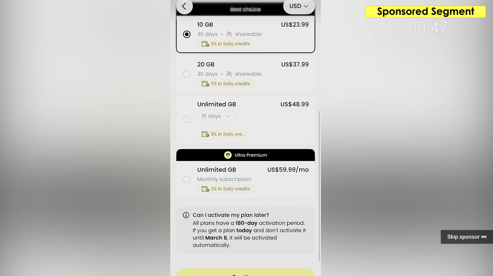

# YouTube Sponsor Segment Skipper

A Chrome MV3 extension that analyzes timed captions ahead of playback and skips creator-inserted sponsor reads using TypeSafe's Jev classifier.

## Start

1. (Optional, local development only) Follow `server/README.md` for dependencies. Start the backend with `cd server`, `export TYPESAFE_API_KEY='your-key'`, then `npm start`. Not needed if you use the deployed backend the extension already points to.
2. Open `chrome://extensions`, enable Developer Mode, and load this project's root directory as an unpacked extension. If already loaded, click Reload.
3. Refresh the YouTube tab and watch normally. Analysis runs in the background; detected sponsor segments are skipped automatically.

After any code change, reload the extension and refresh YouTube. Restart the local server too, if you are running one.

## See it in action

The extension reads the video's timed captions, sends caption segments to Jev for sponsor classification, and stores the detected sponsor ranges. During playback, the extension either skips a detected range automatically or shows a **Skip sponsor** button, depending on the selected setting.

The demo has two parts: it first shows automatic skipping, then shows the YouTube-style **Skip sponsor** button appearing over the player and being clicked: [watch the demo video](demo.mp4).

## Analysis ahead of playback

- Fetches the full timed subtitles, including automatic captions, without running Whisper when captions are usable.
- Classifies every caption segment in the video in one batched pass, because the whole subtitle track already arrives with the metadata.
- Refines each detected read to the word: caption blocks run up to 15 seconds, so short word windows are classified across the transition to find where the read actually starts and ends.
- For videos without usable captions, downloads 30-second audio slices independently of the player, then transcribes locally with Whisper.
- Playback continues while analysis runs, including after seeking into unchecked content. A newly detected sponsor is skipped immediately if playback is already inside it. There is no preparation overlay or automatic pause/resume.
- Caches completed classifications in extension storage. Concurrent tabs of the same video serialize updates. Old live-capture cache entries are ignored.
- The popup shows whether analysis is ready, how far ahead it has checked, and detected ranges. Failed analysis retries after 30 seconds without interrupting playback.
- Automatic skipping is the default. Turn off **Skip automatically** in the popup (or choose **Ask me first** in Settings) to show the on-player button while playback is inside a detected sponsor range.
- You can add your own TypeSafe API key in the popup or Settings. When present, Jev classification runs directly from the extension; the key is stored in local extension storage and is not sent to the project server. The local server is still needed to fetch captions or prepare audio for Whisper. Without a personal key, classification uses the server proxy.

## Limitations

If analysis is late, you may hear part or all of a sponsor before it is detected. Already-passed ranges do not rewind playback. Classifier mistakes and imperfect caption timestamps can cause missed or incorrect skips. Live streams and restricted videos may be unavailable. The audio fallback uses English-only Whisper tiny.en. YouTube's own ads are not the target; the player controller leaves recognized ad playback alone.

Non-empty transcript segments and their context are sent to TypeSafe, so usage grows with viewing time. Audio fallback downloads and transcription run locally. A personal API key stays in the extension; the proxy key stays on the server.

## Development

Run `node --test tests/*.test.cjs` from the project root. The server prints request logs, caption selection, and classifier summaries; start it with `YTSB_VERBOSE=1` to also dump every segment sent to the classifier and every score returned, which is a few hundred lines per video. Inspect the extension's service worker at `chrome://extensions` for scheduling and cache details. The content script does not use ScriptProcessorNode or capture playback audio.
